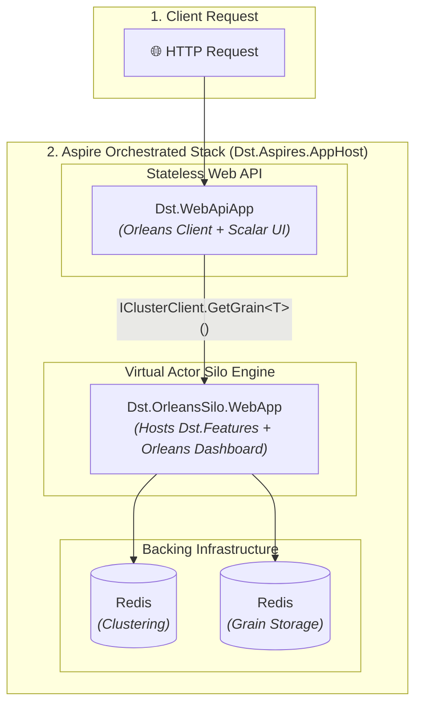

# Aspire + Orleans Distribution System Template

A production-ready `dotnet new` template for building distributed systems with **.NET Aspire** for cloud-native orchestration and **Microsoft Orleans** for virtual actor business logic.

> 💡 **The 3-Folder Rule:** You only touch three folders to build your application:
> - `src/Dst.Core` — Interfaces, grain contracts, shared DTOs
> - `src/Dst.Features` — Grain implementations (your business logic)
> - `src/Dst.WebApiApp` — HTTP endpoints & API routing
>
> Everything else (Silo hosting, Redis clustering, OpenTelemetry, health checks) is preconfigured infrastructure.


## ⚡ Quickstart

### Prerequisites

Make sure **Docker Desktop** (or Docker Engine) is installed and running, as .NET Aspire relies on it to start the Redis container.

### 1. Install & Create Project

```bash
# 1. Install template
dotnet new install Dst.AspireOrleans.Template

# 2. Create your project
dotnet new dst-aspire-orleans -n MyPaymentSystem -o ./my-payment-system
cd my-payment-system

# 3. Initialize Git repository & versioning tag
git init
git add .
git commit -m "feat: initial setup from template"
git tag v0.1.0

# 4. (Optional) Protect main branch on GitHub (requires GitHub CLI: gh auth login)
bash scripts/setup-repo.sh

# 5. Run everything (Aspire Dashboard + Silo + Web API + Redis)
dotnet run --project src/Aspires/Dst.Aspires.AppHost

# 6. Follow Your First Feature in 5 Minutes guide
```

### 2. Open Dashboards

- **Aspire Dashboard:** Open the URL displayed in your terminal (e.g. `https://localhost:17228`) to inspect resources, console logs, and OpenTelemetry traces.
- **Interactive API Reference (Scalar):** Access `https://localhost:<port>/scalar/v1` to test endpoints.
- **Orleans Dashboard:** Access `https://localhost:<silo-port>/orleans-dashboard` to inspect silos, grain activations, and cluster metrics.

### 3. Build Your First Feature

Ready to customize the solution and add your own domain logic? Follow the **[5-Minute E2E Feature Tutorial](docs/first-feature-tutorial.md)** to see how to define contracts in `Dst.Core`, implement Orleans virtual actors in `Dst.Features`, and map Minimal API endpoints in `Dst.WebApiApp`.


## 💡 Key Benefits & Best Practices

- **The 3-Folder Architecture:** Focus strictly on domain interfaces (`Core`), grain logic (`Features`), and API mapping (`WebApiApp`). Zero host or DI boilerplate.
- **Central Package Management (CPM):** All package versions are centralized in [Directory.Packages.props](/Directory.Packages.props).
- **Automatic Versioning (MinVer + Conventional Commits):** Versioning is calculated automatically from git tags and commit history:
  
  | Commit Pattern | Version Bump | Example |
  |---|---|---|
  | `BREAKING CHANGE:`, `feat!:` | **Major** | `1.2.3` $\rightarrow$ `2.0.0` |
  | `feat:` | **Minor** | `1.2.3` $\rightarrow$ `1.3.0` |
  | `fix:`, `chore:`, `docs:` | **Patch** | `1.2.3` $\rightarrow$ `1.2.4` |

- **Official CI/CD Pipelines:** GitHub Actions workflows for PR validation, official builds, and release packaging are pre-configured out-of-the-box.


## 📂 Project Structure & Architecture Overview

```
/
├── src/
│   ├── Dst.Core/                        ← 🟢 [TOUCH THIS] Interfaces, grain contracts, models
│   ├── Dst.Features/                    ← 🟢 [TOUCH THIS] Grain implementations (business logic)
│   ├── Dst.WebApiApp/                   ← 🟢 [TOUCH THIS] HTTP API & client endpoints
│   ├── OrleansSilo/
│   │   └── Dst.OrleansSilo.WebApp/      ← ⚙️ [INFRA] Orleans Silo host
│   └── Aspires/
│       ├── Dst.Aspires.AppHost/         ← ⚙️ [INFRA] Aspire orchestrator
│       └── Dst.Aspires.ServiceDefaults/ ← ⚙️ [INFRA] OpenTelemetry, health checks, resilience
├── tests/
│   └── Dst.HostApplication.Tests/      ← 🧪 Integration tests against the real AppHost
├── docs/                                ← 📖 Deep-dive technical documentation
└── .github/workflows/                   ← 🚢 CI/CD pipelines (PR build, Official build & release)
```

### System Architecture Flow




## 📚 Deep Dive Documentation

For detailed guides, architecture rationale, and operational manuals, explore the documentation in [docs](/docs):

1. 🚀 **[Your First Feature in 5 Minutes](docs/first-feature-tutorial.md):** Step-by-step tutorial building a distributed `BankAccount` grain with endpoints and distributed tracing.
2. 🏛️ **[Architecture & Deep Dive](docs/architecture-and-deep-dive.md):** Orleans Virtual Actor model, CQRS read/write split, anti-pattern warnings, CPM, SDK configuration, TLS decisions, and integration testing.
3. 🏭 **[Production Readiness & Operations](docs/production-readiness.md):** Transition checklist (state storage, clustering, monitoring, secrets), GitHub Actions pipelines, and branch protection setup script.

## 🔗 References & Official Documentation

- **Microsoft Orleans:**
  - [Microsoft Orleans Overview](https://learn.microsoft.com/en-us/dotnet/orleans/overview) — Virtual Actor model overview and core capabilities.
  - [Developing Grains in Orleans](https://learn.microsoft.com/en-us/dotnet/orleans/grains/) — Grain lifecycle, identity, and contracts.
  - [Orleans Dashboard](https://github.com/OrleansContrib/OrleansDashboard) — Operational web dashboard for Orleans cluster metrics.
- **.NET Aspire:**
  - [.NET Aspire Overview](https://learn.microsoft.com/en-us/dotnet/aspire/get-started/aspire-overview) — Official introduction to cloud-native .NET Aspire applications.
  - [.NET Aspire AppHost & Orchestration](https://learn.microsoft.com/en-us/dotnet/aspire/fundamentals/app-host-overview) — Managing resources, containers, and service references.
  - [.NET Aspire StackExchange Redis Integration](https://learn.microsoft.com/en-us/dotnet/aspire/caching/stackexchange-redis-integration) — Containerized Redis hosting for clustering and state caching.

## 📄 License
Licensed under the [MIT License](LICENSE).

